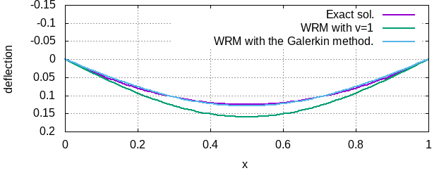

$$
\newcommand{\bs}[1]{\boldsymbol{#1}}
\newcommand{\dfrac}[2]{\displaystyle\frac{\text{d}{#1}}{\text{d}{#2}}}
\newcommand{\ddfrac}[2]{\displaystyle\frac{\text{d}^2{#1}}{\text{d}{#2}^2}}
$$

# 1. イントロダクション: 1次元問題に対する有限要素法

本章では, 有限要素法 (finite element method; FEM) の概念を説明することを目的とし, $x\in[0,1]$ で定義された二階常微分方程式

$$
\frac{\text{d}^2 u(x)}{\text{d} x^2} = -f(x)
$${#eq:governing_eq}

を対象とした有限要素法について述べる. ここに, $u(x)$ は未知のスカラー関数, $f(x)$ は既知のスカラー関数である. 

## 境界値問題の定式化

はじめに, 弦のたわみが式 ([@eq:governing_eq]) で記述される物理現象 (の一つ) であることを確認しよう. 今, [@fig:setting] のように, 両端が固定された長さ 1 の弦に, 下向き分布荷重 $q(x)$ が作用した時, 点 $x$ におけるたわみ $v(x)$ を求める問題を考えよう. なお, 荷重は下向きに作用するので, 縦軸は下向きを正にとる. 

{#fig:setting}

微小領域 $[x,x+\text{d}x]$ における弦に作用する力の釣り合いを考える ([@fig:equiv]). 

{#fig:equiv}

弦に働く張力を $T$ と書き, 変形が微小であることを仮定すれば $\sin\theta\simeq\tan\theta=\displaystyle\frac{\text{d}u(x)}{\text{d}x}$ だから, 左端 $x$ に作用する張力の鉛直方向成分は $-T\sin\theta\simeq-T\dfrac{u(x)}{x}$ と書ける. 同様にして, 右端 $x+\text{d}x$ に作用する張力の鉛直方向成分は

$$
T\dfrac{u(x+\text{d}x)}{x}
\simeq T\left(\dfrac{u(x)}{x}+\ddfrac{u(x)}{x}\text{d}x\right)
$$

である. さらに, 与えられた分布荷重が微小領域において一定値 $q(x)$ を取るとすれば, 力の釣り合いは

$$
-T\dfrac{u(x)}{x}+T\left(\dfrac{u(x)}{x}+\ddfrac{u(x)}{x}\text{d}x\right)+q(x)\text{d}x=0
$$

と書ける. これを整理して, $f(x)=q(x)/T$ とおけば式 ([@eq:governing_eq]) を得る. 

今, 弦は両端で固定されているので, 境界条件は 

$$
u(0)=u(1)=0
$${#eq:bc}

である. 微分方程式 ([@eq:governing_eq]) と境界条件 ([@eq:bc]) の組みを**境界値問題 (boudnary value problem; BVP)** と呼ぶ. 有限要素法は境界値問題の数値解法のひとつである. なお, 式 ([@eq:bc]) のように, 未知関数そのものの境界値を与える境界条件を Dirichlet 境界条件という. 一方で, 未知関数の境界での微分値を与える境界条件は Neumann 境界条件, Dirichlet 条件と Neumann 条件の線形結合を与える境界条件は Robin 境界条件と呼ばれる. 

> **問**: $f(x)=1$ のとき, 上の Dirichlet 境界値問題の解を解析的に (=手計算で積分し) 求めよ. 特に, $x=1/2$ における $u$ の値はいくらか?

> **解**: $u(x)=-\displaystyle\frac{1}{2}x^2+\displaystyle\frac{1}{2}x$ であり, 特に $u(1/2)=1/8$ となる.

## 重み付き残差法 (weighted residual method; WRM) と Galerkin 法

先の「問」においては, 解析的に微分方程式を解くことができた. しかし, 一般にはこれは難しい. そこで $u$ をなんらかの意味で近似する関数 $\tilde{u}$ を求めることが必要となる. 以下, $\tilde{u}$ を求める方法の一つである重み付き残差法について解説する. 

まず,  $\tilde{u}$ が $u$ が満たすべき境界条件 ([@eq:bc]) を満足することを要請しよう. すると, $g_i(0)=g_i(1)=0$ を満たす関数 $g_i(x)$ (例えば $g_i(x)=x^{i+1}(1-x)$ など) を用いて構成される

$$
\sum_{i=0}^{n-1} a_i g_i(x)
$${#eq:aigi}

は $\tilde{u}$ の候補となる. ここに, $a_i\in\mathbb{R}$ は未知の係数である. 未知係数 $a_i$ を求めるため, ここでは**重み付き残差法**を採用する. その他の方法としては, 微分方程式の定義された領域内部の有限個の点 $x_i \ (i=0,\cdots, n-1)$ において微分方程式を満たすように $a_i$ を決める**選点法**が代表的である.

はじめに, 適当な重み関数 $v_i(x)$ を $i=0, \cdots, n-1$ の $n$ 種類準備する. 次に, 微分方程式 ([@eq:governing_eq]) の両辺にこれを乗じ, 微分方程式の定義された領域 $[0, 1]$ において積分すると以下を得る.

$$
\int_0^1 v_i \left( \ddfrac{\tilde{u}(x)}{x}+f(x) \right) \text{d}x=0
$${#eq:wre}

式 ([@eq:wre]) を**重み付き残差式**と呼ぶ. これを満たすように未知係数 $a_i$ を定める方法を**重み付き残差法**である.

> **例**: $f(x)=1$の場合を考える. $n=1$, $g_i(x)=\sin (i+1) \pi x$ とし, 重み付き残差法を実行せよ. ただし, ここでは重み関数は以下のように選べ.

> 1. **$v_i(x)=1$**

> 2. **$v_i(x)=g_i(x)$**

> **解**

> 1. 

>重み付き残差式 ([@eq:wre]) より, 

> $$ 
> \begin{align}
> 0
> &=\int_0^1 \left( \ddfrac{(a_0 \sin\pi x)}{x}+1 \right) \text{d}x\\
> &=\int_0^1 \left( -a_0\pi^2\sin\pi x+1 \right) \text{d}x\\
> &=\left[ a_0\pi\cos\pi x +x  \right]_0^1\\
> &=-2a_0\pi+1
> \end{align}
> $$

> であるから, $a_0=1/2\pi$ を得る. この時, $u$ の近似解は $\tilde{u}(x)=\displaystyle\frac{1}{2\pi}\sin\pi x$ となる. 特に, $\tilde{u}(1/2)=1/2\pi$ であるが, ここで得た近似解と先に求めた「正解」との相対誤差は 
> $$
> \frac{|1/2\pi-1/8|}{1/8} \simeq 27.3\%
> $$

> ほどである. 

> 2. 

>重み付き残差式 ([@eq:wre]) より, 

> $$ 
> \begin{align}
> 0
> &=\int_0^1 \sin\pi x\left( \ddfrac{(a_0 \sin\pi x)}{x}+1 \right) \text{d}x\\
> &=\int_0^1 \sin\pi x \left( -a_0\pi^2\sin\pi x+1 \right) \text{d}x\\
> &=\left[ -\frac{a_0\pi}{2}x-\frac{1}{\pi}\cos\pi x \right]_0^1\\
> &=-\frac{a_0\pi^2}{2}+\frac{2}{\pi}
> \end{align}
> $$

> であるから, $a_0=4/\pi^3$ を得る. この時, $u$ の近似解は $\tilde{u}(x)=\displaystyle\frac{4}{\pi^3}\sin\pi x$ となる. 特に, $\tilde{u}(1/2)=4/\pi^3$ であるが, ここで得た近似解と先に求めた「正解」との相対誤差は 
> $$
> \frac{|4/\pi^3-1/8|}{1/8} \simeq 3.20\%$$
> ほどである. 
 
{#fig:example}
<!-- 例題の 1, 2 で得られた「数値解」と「正解」の様子を [@fig:example] に示す.  -->
 
例の 2 で見たように, 解を展開するのに用いた基底 $g_i$ と同じ関数を重みとする方法を **Galerkin 法** という. Galerkin 法が高精度であることはこれらの例からよく分かるであろう. 

### 演習問題

> 先の問題に対し, $\tilde{u}=a_0 x(1-x) + a_1 x^2(1-x)$ とした時, 重み付き残差式 ([@eq:wre]) を Galerkin 法で離散化し, 未知係数 $a_i$ を求めよ. 
> 

## 有限要素法

さて, 前項では, 重み付き残差式 ([@eq:wre]) をそのまま利用した. ここでは, これを少し変形してみよう. ここでは, 重み関数 $v_i$ として, Dirichlet 境界条件が課された境界において, $v_i=0$ を満たすものを用いると**約束**しよう. この時, 重み付き残差式 ([@eq:wre]) を部分積分して得られる

$$
\begin{align}
&0=\left[ u'(x)v_i(x) \right]_0^1 - \int_0^1 (v_i'(x)u'(x)-v_i(x)f(x)) \text{d}x\\
&\Leftrightarrow \int_0^1 v_i'(x)u'(x) \text{d}x = \int_0^1 v_i(x)f(x) \text{d}x \ \ \ (\because v_i(0)=v_i(1)=0)
\end{align}
$${#eq:weakform}

を**弱形式**という. 

---

[../](../index.html)
