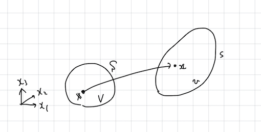
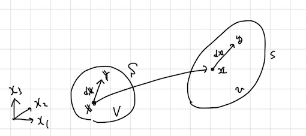

$$
\newcommand{\bs}[1]{\boldsymbol{#1}}
\newcommand{\dfrac}[2]{\displaystyle\frac{\text{d}{#1}}{\text{d}{#2}}}
\newcommand{\ddfrac}[2]{\displaystyle\frac{\text{d}^2{#1}}{\text{d}{#2}^2}}
\newcommand{\dintegral}[3]{\int_{#1}^{#2} {#3} \mathrm{d}x}
$$

# 3. 連続体力学: 連続体の変形

連続体とは、 **変形** を伴って運動する物体のモデルである. これまでに学んだ

- 質点: 物体を質量のみが定義された空間的な広がりを持たない点によりモデル化したもの. 物体の並進運動を記述することができる. 

- 剛体: 物体を質点の集合体としてモデル化したもの. 剛体内部の任意の二点間の距離は運動に際して不変. 物体の並進運動に加え, 回転を記述することできる. 

の発展的なモデルとみなすことができる. 本章の目標は, 連続体の変形を表す物理量として **ひずみ (strain)** を定義することである. なお, 本章ではテンソルを明確な定義なしに用いるが, その定義は次章において述べる. ここではテンソルを行列と混同して構わない. 

## 変位

適当な座標系をもつ空間において, 境界を $S$ とする有限の大きさの物体 $V$ の内部に埋め込まれた点 $\bs{X}$ を考える. この物体が変形し, $V$, $S$, $\bs{X}$ がそれぞれ $v$, $s$, $\bs{x}$ に変化したとする ([@fig:displacement]). この時, 

$$
\bs{u}:=\bs{x}-\bs{X}
$${#eq:displacement}

を **変位 (displacement)** という. 変位 $\bs{u}$ は連続体内部の各点の移動量を表すが, 変位を眺めても物体 $V$ がどのように変形したかはよく分からない. 

{#fig:displacement}

以降の議論においては, 変形前の点 $\bs{X}$ を変形後の点 $\bs{x}$ にうつす写像 $\bs{x}=\bs{x}(\bs{X})$ が, 一対一であって (したがって逆写像 $\bs{x}=\bs{X}(\bs{x})$ が定義できて), かつ十分に滑らかである (必要なだけ微分できる) と仮定する.

## 変形勾配テンソル

先の例においては変形する連続体内部の一点に注目したが、ここでは [@fig:strain] に示すように, 連続体内部に埋め込まれた短いベクトル $\mathrm{d}\bs{X}:=\bs{Y}-\bs{X}$ を考える. 変形に伴い, これが $\mathrm{d}\bs{x}:=\bs{y}-\bs{x}$ となったとする. 

{#fig:strain}

先に定義した写像 $\bs{x}$ を用いて $\mathrm{d}\bs{x}$ の一次近似を評価すると

$$
\begin{align}
\mathrm{d}x_i
&=x_i(\bs{Y})-x_i(\bs{X})\\
&=x_i(\bs{X}+\mathrm{d}\bs{X})-x_i(\bs{X})\\
&\simeq x_i(\bs{X})+\frac{\partial x_i(\bs{X})}{\partial X_j}\mathrm{d}X_j-x_i(\bs{X})\\
&=\frac{\partial x_i(\bs{X})}{\partial X_j}\mathrm{d}X_j
\end{align}
$${#eq:F}

と書ける (式 ([@eq:F]) において Einstein の総和規約を用いたことに注意せよ. すなわち, $j$ はダミーインデックスであり, $j$ についての和の記号を省略している). ここで, ([@eq:F]) 右辺は, $\partial x_i/\partial X_j$ を $ij$ 成分にもつ行列 $\mathsf{F}$ とベクトル $\mathrm{
d}\bs{X}$ の積 (の第 $i$ 成分) に他ならない. ここで, $\mathsf{F}$ を **変形勾配テンソル** と呼ぶ. 

> **問 1**: 変形勾配テンソルの「行列式」 (=$\text{det }\mathsf{F}$) が何を意味するか述べよ. また, $\text{det } \mathsf{F}>0$ すなわち $\mathsf{F}$ が正定であることを示せ. ヒント: ベクトル $\mathrm{d}\bs{X}$, $\mathrm{d}\bs{Y}$, $\mathrm{d}\bs{Z}$ からなる平行六面体の体積が, $\mathsf{F}$ により特徴づけられる変形に伴ってどのように変化するかを考えよ.

> **問 2**: 変形勾配テンソルの成分を Kronecker のデルタと変位を用いて表わせ. 

> **問 3**: 変形勾配テンソルが直交行列であるとき, ベクトル $\mathrm{d}\bs{X}$ と $\mathrm{d}\bs{x}$ の「長さ」が等しいことを示せ. 

## Green のひずみテンソルと Almansi のひずみテンソル

$$
\mathrm{d}\bs{x}=\mathsf{F}\mathrm{d}\bs{X}
$$

に現れる変形勾配 $\mathsf{F}$ は, ベクトルを変形させる作用のみならずこれを回転させる作用も含んでいる. そこで, 以降, $\mathsf{F}$ を回転を表す成分と変形を表す成分に分解することを目指す. そのような分解の存在は、正定値行列 $\mathsf{F}$ に対する以下の定理により保証される. 

> **定理**
> 正定値行列 $\mathsf{F}$ は直交行列 $\mathsf{R}$ と正定値対称行列 $\mathsf{U}$, $\mathsf{V}$ を用いて, 以下のように **極分解** でき, またそのような $\mathsf{R}$, $\mathsf{U}$ 及び $\mathsf{V}$ は一意に定まる. 
> $$
> \mathsf{F}=\mathsf{RU}=\mathsf{VR}
> $${#eq:kyokubunkai}

以降, 上記の定理を証明する. 特に, 式 ([@eq:kyokubunkai]) のはじめの等号が成り立ち, かつそのような分解が一意であることを示す. 2つめの等式が成り立つことも同様にして証明できる. はじめに, $\mathsf{F}$ が正定値であるとき, $\mathsf{F}^\mathrm{T}\mathsf{F}$ もまた正定値であって, 対称となることに注意しよう. 正定値であることは「行列の積の行列式」が「行列式の積」に等しいことから

$$
\begin{align}
\mathrm{det} \ \mathsf{F}^\mathrm{T}\mathsf{F}
&=\mathrm{det} \ \mathsf{F}^\mathrm{T}\mathrm{det} \ \mathsf{F}\\
&=(\mathrm{det} \ \mathsf{F})^2\\
&>0 \ \ \ (\because \mathsf{F}\text{が正定値})
\end{align}
$$

とすれば分かる. 対称であることは

$$
\begin{align}
(\mathsf{F}^\mathrm{T}\mathsf{F})_{ij}
&= \mathsf{F}^\mathrm{T}_{ik}\mathsf{F}_{kj} \\
&= \mathsf{F}_{ki}\mathsf{F}^\mathrm{T}_{jk} \\
&= \mathsf{F}^\mathrm{T}_{jk}\mathsf{F}_{ki} \\
&=(\mathsf{F}^\mathrm{T}\mathsf{F})_{ji}
\end{align}
$$

のように成分を計算すれば分かる. つぎに, 

> (補題) 任意の正定値対称行列 $\mathsf{A}$ に対して, $\mathsf{A}=\mathsf{B}^2$ を満たす正定値対称行列 $\mathsf{B}$ が存在して一意である

(証明は後述) により, $\mathsf{F}^\mathrm{T}\mathsf{F}=\mathsf{U}^2$ を満たす正定値対称行列 $\mathsf{U}$ が存在して一意である. 今, $\mathsf{U}$ は正定値行列であるからその逆 $\mathsf{U}^{-1}$ が存在する. したがって, 

$$
\mathsf{R}:=\mathsf{F}\mathsf{U}^{-1}
$${#eq:R}

が定義できるが, 

$$
\begin{align}
\mathsf{R}^\mathrm{T}\mathsf{R}
&=\mathsf{U}^{-1}\mathsf{F}^\mathrm{T}\mathsf{F}\mathsf{U}^{-1}
\ \ \ (\because \mathsf{U} \text{は対称})\\
&=\mathsf{U}^{-1}\mathsf{U}^2\mathsf{U}^{-1}\\
&=\mathsf{I}
\end{align}
$$

より, $\mathsf{R}$ は直交行列である. $\mathsf{U}$ の一意性より式 ([@eq:R]) で定義される $\mathsf{R}$ もまた一意である. 一方で, 式 ([@eq:R]) は $\mathsf{F}=\mathsf{RU}$ に他ならず, 先の定理が示された. 

さて, 定理の証明に用いた補題の証明を見ておこう. 任意の正定値対称行列 $\mathsf{A}$ は直交行列 $\mathsf{P}$ を用いて 

$$
\mathsf{P}^\mathrm{T}\mathsf{A}\mathsf{P}=\Lambda
$${#eq:a_diag}

と対角化可能である. ここに, $\Lambda:=\mathrm{diag}(\lambda_1, \lambda_2, \cdots)$ は対角行列であり, その対角成分は全て正である. ここで, $\mathsf{B}:=\mathsf{P}\Lambda^{1/2}\mathsf{P}^\mathrm{T}$ を定義すると, これが正定値対称行列であること, $\mathsf{B}^2=\mathsf{A}$ を満たすことは明らかであろう. なお, 対角行列 $\Lambda^{1/2}:=\mathrm{diag}(\sqrt{\lambda_1}, \sqrt{\lambda_2}, \cdots)$ を定義した. 以下, ここで定義した $\mathsf{B}$ 以外に, その二乗が $\mathsf{A}$ に等しい正定値対称行列が存在しないことを示して補題の証明を終わる. そのような行列 $\tilde{\mathsf{B}}$ の存在を仮定する. すなわち, $\mathsf{A}=\mathsf{B}^2=\tilde{\mathsf{B}}^2$ であって $\mathsf{B}\neq\tilde{\mathsf{B}}$ である正定値対称行列 $\tilde{\mathsf{B}}$ を考える. $\tilde{\mathsf{B}}$ のある固有値 $\sqrt{\tilde{\lambda}}>0$ と対応する固有ベクトル $\tilde{\bs{p}}$ に対し

$$
\begin{align}
\tilde{\mathsf{B}}\tilde{\bs{p}}=\sqrt{\tilde{\lambda}}\tilde{\bs{p}}
&\Leftrightarrow\tilde{\mathsf{B}}^2\tilde{\bs{p}}=\tilde{\mathsf{B}}\sqrt{\tilde{\lambda}}\tilde{\bs{p}}=\sqrt{\tilde{\lambda}}^2\tilde{\bs{p}}\\
&\Leftrightarrow\mathsf{A}\tilde{\bs{p}}=\tilde{\lambda}\tilde{\bs{p}}
\end{align}
$$

であり, $\mathsf{A}$ の固有ベクトルは $\tilde{\mathsf{B}}$ の固有ベクトルでもある. したがって, 式([@eq:a_diag]) の直交行列 $\mathsf{P}$ を用いて $\tilde{\mathsf{B}}$ を対角化することができて, 

$$
\mathsf{P}^\mathrm{T}\tilde{\mathsf{B}}\mathsf{P}=\tilde{\Lambda}^{1/2}
$$

である (ここに, $\Lambda^{1/2}$ は $\tilde{\mathsf{B}}$ の固有値を対角に並べた対角行列) が, 両辺を二乗すれば

$$
\mathsf{P}^\mathrm{T}\tilde{\mathsf{B}}^2\mathsf{P}=\tilde{\Lambda}
\Leftrightarrow\mathsf{P}^\mathrm{T}\mathsf{A}\mathsf{P}=\tilde{\Lambda}
$${#eq:a_diag2}

となる. 式 ([@eq:a_diag]) と式 ([@eq:a_diag2]) を比較すれば, $\Lambda=\tilde{\Lambda}$ を得るが, $\Lambda^{1/2}$, $\tilde{\Lambda}^{1/2}$ の成分は正なので, $\Lambda^{1/2}=\tilde{\Lambda}^{1/2}$ である. したがって, $\tilde{\mathsf{B}}=\mathsf{B}$ となり, 補題が示された. 

> **問 4** 対称行列の固有値が全て実数であることを証明せよ. 

> **問 5** 式 ([@eq:kyokubunkai]) の ２ つめの等号を示せ. 

左コーシー・グリーンテンソル
B = V^2 = F F^T

右コーシー・グリーンテンソル
C = U^2 = F^T F

dxdx=FdXFdX=dXCdX

dxdx-dXdX=dx(I-B^{-1})dx
dxdx-dXdX=dX(C-I)dX

I-B^{-1}, C-I :回転を含まない == 変形を表す

(C-I)/2: Greenのひずみテンソル
(I-B^{-1})/2: Almansiのひずみテンソル

## 微小ひずみ

---

[../](../index.html)
