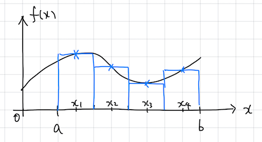
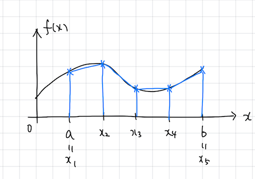

$$
\newcommand{\bs}[1]{\boldsymbol{#1}}
\newcommand{\dfrac}[2]{\displaystyle\frac{\text{d}{#1}}{\text{d}{#2}}}
\newcommand{\ddfrac}[2]{\displaystyle\frac{\text{d}^2{#1}}{\text{d}{#2}^2}}
\newcommand{\dintegral}[3]{\int_{#1}^{#2} {#3} \mathrm{d}x}
$$

# 2. 数学的な準備: Gauss-Legendre の数値積分公式

有限要素法では, 弱形式を離散化して得られる代数方程式を数値的に (= 一般には計算機を用いて) 解くことで (偏) 微分方程式の境界値問題の近似解を得る. その際, 代数方程式の係数行列や右辺ベクトルの成分は積分の形で書かれる. [1. イントロダクション](../1d/index.html)で見たような簡単な問題の場合はこれらの積分を解析的に評価できるが, 一般に積分を解析的に実行することは容易ではない. そこで, これらの積分 (の近似) を数値的に求める方法が重要となる. そのような方法は **数値積分公式**, **求積法 (quadrature rule)** などと呼ばれる. ここでは, 有限要素法において用いられる Gauss-Legendre 数値積分公式について解説する.

## イントロダクション: 区分求積分と台形公式

与えられた関数 $f(x)$ の区間 $[a,b]$ にわたる定積分

$$
I=\dintegral{a}{b}{f(x)}
$${#eq:integral}

に対する数値積分公式は以下のようである.

$$
I\simeq\sum_{i=1}^N f(x_i) w_i
$${#eq:nintegral}

ここに, $a\le x_i\le b$ は **積分点** あるいは **分点**, $w_i$ は **重み** と呼ばれる. また, 分点を $N$ 個用いる数値積分公式を $N$ 次の公式と呼ぶことがある.

最も単純な数値積分公式 (すなわち, 公式 ([@eq:integral]) の積分点, 重みの定め方) は **区分求積法** であろう. 区分求積では区間 $[a,b]$ を $N$ 等分割し, 例えば, $x_i=a+\displaystyle\frac{2i-1}{2N}(b-a)$, $w_i=\displaystyle\frac{b-a}{N}$ と選ぶ ([@fig:kubunkyuseki]).

{#fig:kubunkyuseki}

また, 同様に区間 $[a,b]$ を $N$ 等分割し, $x_i=a+\displaystyle\frac{i-1}{N-1}(b-a)$, $w_0=w_N=\displaystyle\frac{b-a}{2(N-1)}$, $w_1=w_2=\cdots=w_{N-1}=\displaystyle\frac{b-a}{N-1}$とする **台形公式** も有名な数値積分公式である([@fig:daikeikoushiki]).

{#fig:daikeikoushiki}

[@fig:kubunkyuseki] と [@fig:daikeikoushiki] を比較すれば, 区分求積よりも台形公式の方が積分の精度は良さそうである. しかし, 台形公式を用いた場合, 式 ([@eq:integral]) で与えられる積分を **厳密に** 計算できるのは被積分関数 $f(x)$ が区分的に一次関数である場合に限られる. では, あるクラスの関数 $f$ の定積分を厳密に (=誤差0で) 計算できる数値積分公式は存在するだろうか? 実は, $N$ 次の Gauss-Legendre の数値積分公式は, **$f$ が $2N-1$ 次以下の多項式であるならば厳密な積分値を与える** ように設計された数値積分公式である. 次節で, そのような分点・重みの定め方について見てみよう.

## Gauss-Legendre の数値積分公式

### Lagrange 補間

本節では, Gauss-Legendre の数値積分公式を記述する上で必要となる Lagrange 補間について確認する. Lagrange 補間とは, 与えられた相異なる点 $(x_i, f_i)$ $(i=1,\cdots,n)$ に対し, $f(x_i)=f_i$ を満たす $n-1$ 次多項式, およびこれを求める手順のことを言う. 例えば, $N=3$ の場合を考えてみよう. この時, $\mathbb{R}^2$ の $3$ つの点 $(x_1, f_1)$, $(x_2, f_2)$, $(x_3, f_3)$ を通る $2$ 次多項式 $f(x)=a_2x^2+a_1x+a_0$ を求めれば良い. 定義に従って, 連立方程式 $f(x_i)=f_i$ を未知係数 $a_0, a_1, a_2$ について解いても良いが, そのような多項式が一意に定まることを考慮すれば, 

$$
f(x)
=\frac{(x-x_2)(x-x_3)}{(x_1-x_2)(x_1-x_3)}f_1
+\frac{(x-x_3)(x-x_1)}{(x_2-x_3)(x_2-x_1)}f_2
+\frac{(x-x_1)(x-x_2)}{(x_3-x_1)(x_3-x_2)}f_3
$${#eq:lagrange3}

とすれば良いことが直ちに分かる. 一般の $N$ に対しては, 

$$
f(x)=\sum_{i=1}^{N} \prod_{j\ne i}\frac{x-x_j}{x_i-x_j}
$${#eq:lagrangen}

とすれば良い. 

> **問**: $N=2$ のときは?

> **解**: $f(x)=\frac{(x-x_2)}{(x_1-x_2)}f_1+\frac{(x-x_1)}{(x_2-x_1)}f_2$

### Legendre 多項式

次に, もう一つの鍵となる Legendre 多項式を導入する. Legendre 多項式は **直交多項式** の一種であり, $n$ 次の Legendre 多項式 $p_n(x)$ とは $k=0,\cdots, n-1$ に対して以下を満たすものである. 

$$
\dintegral{-1}{1}{p_n(x)p_k(x)}=0
$${#eq:tyokkou}

式 ([@eq:tyokkou]) の左辺は, 関数 $p_n$ と $p_k$ の内積と見なすことができ, これが零であることから $p_n$ は **直交** 多項式と呼ばれる. 式 ([@eq:tyokkou]) を満たす $p_n$ の定数倍はまたこれを満足することから, $p_n$ には定数倍の自由度がある. ここでは, 

$$
p_n(1)=1
$${#eq:seikika}

を用いてこれを正規化する. 正規化の方法は, 文献に依って ([@eq:seikika]) と異なるため注意が必要である. また, ここで定義した ${p_n}$ は正規直交基底を為さない (すなわち, $\displaystyle\dintegral{-1}{1}{p_n(x)p_n(x)}\neq 1$ である) ことにも注意されたい. 

> **問**: Legendre 多項式の定義 ([@eq:tyokkou]), ([@eq:seikika]) を参照し, $p_0$, $p_1$, $p_2$ を陽に書け.

> **解**:

$$
\begin{align}
p_0(x)&=1\\
p_1(x)&=x\\
p_2(x)&=\frac{1}{2}(3x^2-1)
\end{align}
$$

任意の $n$ に対して Legendre 多項式 $p_n(x)$ の陽な表現を生成する公式は Rodrigues の公式と呼ばれ, 以下のようである. 

$$
p_n(x)=\frac{1}{2^nn!}\frac{\mathrm{d}^n}{\mathrm{d}x^n}\left\{(x^2-1)^n\right\}
$${#eq:rodrigues}

また, Legendre 多項式は以下の Bonnet の漸化式を満たす. 

$$
(n+1)p_{n+1}(x)=(2n+1)xp_n(x)-np_{n-1}(x)
$${#eq:zenkasiki}

さらに, Legendre 多項式の定義 ([@eq:tyokkou]) を用いれば, 任意の高々 $k~(k=0,\cdots,n-1)$ 次の多項式 $q_k$ に対して

$$
\dintegral{-1}{1}{p_n(x)q_k(x)}=0
$${#eq:tyokkou2}

が成り立つことはほとんど明らかであろう. 

## Gauss-Legendre の数値積分公式

以上の準備の下, Gauss-Legendre の数値積分公式を導出する. 例として, 3次多項式 $f_3(x)$ の $[-1,1]$ における定積分 $I_3$ を考えよう. はじめに, $f_3$ を 2 次の Legendre 多項式 $p_2$ で以下のように「割り算」する. 

$$
f_3(x)=p_2(x)q_1(x)+r_1(x)
$${#eq:warizan}

ここに, $~q_1, r_1$ は $x$ の 1 次多項式である. これを用いれば, 

$$
\begin{align}
I_3
&=\dintegral{-1}{1}{f_3(x)}\\
&=\dintegral{-1}{1}{p_2(x)q_1(x)}+\dintegral{-1}{1}{r_1(x)}\\
&=\dintegral{-1}{1}{r_1(x)}
\end{align}
$${#eq:aaa}

となる. ここで, Legendre 多項式の性質 ([@eq:tyokkou2]) を用いた. **直交性** を用いることで, 3 次関数の積分が 1 次関数の積分に帰着されたことに注意しておこう. さらに, $r_1$ を $x=x_1, x_2$ で Legendre 補間すれば, 

$$
\begin{align}
I_3
&=\dintegral{-1}{1}{\frac{x-x_2}{x_1-x_2}r_1(x_2)}+\dintegral{-1}{1}{\frac{x-x_1}{x_2-x_1}r_1(x_2)}\\
&=\frac{-2x_2}{x_1-x_2}r_1(x_1)+\frac{-2x_1}{x_2-x_1}r_1(x_2)
\end{align}
$${#eq:bbb}

を得る. $x_1, x_2$ として, $p_2(x_i)=0$ を満たすもの (すなわち, Legendre 多項式の零点) を用いれば, 式　([@eq:warizan]) より

$$
\begin{align}
f_3(x_i)&=p_2(x_i)q_1(x_i)+r_1(x_i)\\
&=r_1(x_i)
\end{align}
$${#eq:warizan2}

であるから, 

$$
\begin{align}
I_3
&=\frac{-2x_2}{x_1-x_2}f_3(x_1)+\frac{-2x_1}{x_2-x_1}f_3(x_2)
\end{align}
$${#eq:ccc}

となる. $p_2(x)=(3x^2-1)/2$ であるから, その零点は $x_1=-1/\sqrt{3}, x_2=1/\sqrt{3}$ である. これを式 ([@eq:ccc]) に代入すれば

$$
\begin{align}
I_3=\dintegral{-1}{1}{f_3(x)}=f_3(-1/\sqrt{3})\times 1 + f_3(1/\sqrt{3})\times 1
\end{align}
$${#eq:ddd}

が **厳密に** 成り立つ. 式 ([@eq:ddd]) を式 ([@eq:nintegral]) において $x_1=-1/\sqrt{3}, x_2=1/\sqrt{3}$, $w_1=w_2=1$ とおいたものと見比べれば, これが 2 次の Gauss-Legendre 数値積分公式に他ならないことが分かるであろう. ここで見たように, 2 次の Gauss-Legendre 数値積分は高々 3 次の多項式の正確な定積分を与える. 一般に, $n$ 次の Gauss-Legendre 数値積分は高々 $2n-1$ 次の多項式の正確な定積分を与える. 実は, $n$ 次の数値積分公式を用いて $2n$ 次以上の多項式を正確に積分することはできないことを容易に示すことができる (直感的には, $n$ 次の数値積分公式の持つ自由度 $2n$ (= $n$ 個の分点と $n$ 個の重み) と $2n-1$ 次多項式の持つ自由度 $2n$ (=定数項を含む各項の係数) が一致するからであると理解すれば良い). この意味で, Gauss-Legendre 数値積分は「最適」な公式であると言える (ただし, 被積分 $f$ が多項式でない場合にも精度良く積分値を与えるという意味ではない). 

以下, Gauss-Legendre 数値積分の分点と重みの計算法について説明する. はじめに, $n$ 次の Legendre 多項式の零点 $x_i$ が区間 $[-1, 1]$ の内部に $n$ 個存在することを証明しておこう. 

> **定理**: $n\ge 1$ の Legendre 多項式 $p_n(x)$ の零点は全て単根であり (=相異なり) $[-1,1]$ の内部に存在する. 

> **証明**: $n\ge 1$ より, $\displaystyle\dintegral{-1}{1}{p_n(x)}=\displaystyle\dintegral{-1}{1}{p_n(x)p_0(x)}=0$ であるが, $[-1,1]$ において $p_n$ は恒等的に零ではないから, $p_n$ は $[-1,1]$ で少なくとも一度は符号が変わる. そのような点を $x_1, x_2, \cdots, x_k~(1\le k\le n)$ と書こう. $k\le n$は, $n$ 次多項式が $n+1$ 個以上の零点を持ち得ないことから分かる. ここで, $x_i$ の前後で $p_n$ の符号が変わることからその重複度は奇数である. したがって, $k$ 次多項式 $q_k(x)=\displaystyle\prod_{j=1}^k(x-x_j)$ に対し, $p_n(x)q_k(x)$ は $[-1,1]$ で符号が変わらない. このことから,

$$
\dintegral{-1}{1}{p_n(x)q_k(x)}\neq 0
$${#eq:eee}

> である. 一方, Legendre 多項式の性質 ([@eq:tyokkou]) より, 高々 $n-1$ 次の多項式 $q_{n-1}$ に対して

$$
\dintegral{-1}{1}{p_n(x)q_{n-1}(x)}= 0
$${#eq:fff}

> である. 式 ([@eq:eee]) と式 ([@eq:fff]) より, $k=n$ である. 以上より, $p_n(x)$ は $[-1,1]$ に $n$ 個の零点を持ち, それらは全て単根である. 

次に, 分点を求める方法について述べる. 漸化式 ([@eq:zenkasiki]) を変形して得られる

$$
xp_n(x)=\frac{n}{2n+1}p_{n-1}(x)+\frac{n+1}{2n+1}p_{n+1}(x)
$${#eq:zenkasiki2}

を $n=0, \cdots, N-1$ まで並べて表示すれば

$$
x
\begin{pmatrix}
p_0(x)\\
p_1(x)\\
\vdots\\
p_{N-2}(x)\\
p_{N-1}(x)
\end{pmatrix}
=
\begin{pmatrix}
0 & 1 & 0 & \cdots & 0\\
\frac{1}{3} & 0 & \frac{2}{3} & \ddots & \vdots\\
0 & \frac{2}{5} & 0 & \ddots & 0\\
\vdots & \ddots & \ddots & \ddots & \frac{n-1}{2n-3}\\
0 & \cdots & 0 & \frac{n-1}{2n-1} & 0
\end{pmatrix}
\begin{pmatrix}
p_0(x)\\
p_1(x)\\
\vdots\\
p_{N-2}(x)\\
p_{N-1}(x)
\end{pmatrix}
+
\begin{pmatrix}
0\\
\vdots\\
\vdots\\
0\\
\frac{n}{2n-1}p_{N}(x)
\end{pmatrix}
$${#eq:zenkasiki_gyouretu}

となる. $x_j~(j=1,\cdots,N)$ を $p_N$ の零点として, $x=x_j$ を式 ([@eq:zenkasiki_gyouretu]) に代入すれば, $x_j$ を解に持つ固有値問題

$$
x_j
\begin{pmatrix}
p_0(x_j)\\
p_1(x_j)\\
\vdots\\
p_{N-2}(x_j)\\
p_{N-1}(x_j)
\end{pmatrix}
=
\begin{pmatrix}
0 & 1 & 0 & \cdots & 0\\
\frac{1}{3} & 0 & \frac{2}{3} & \ddots & \vdots \\
0 & \frac{2}{5} & 0 & \ddots & 0\\
\vdots & \ddots & \ddots & \ddots & \frac{n-1}{2n-3}\\
0 & \cdots & 0 & \frac{n-1}{2n-1} & 0
\end{pmatrix}
\begin{pmatrix}
p_0(x_j)\\
p_1(x_j)\\
\vdots\\
p_{N-2}(x_j)\\
p_{N-1}(x_j)
\end{pmatrix}
$${#eq:koyuchi}

を得る. これを数値的に解けば Gauss-Legendre 数値積分の分点が求まる. この手順を Golub–Welsch のアルゴリズムという. 実際には, 固有値問題 ([@eq:koyuchi]) に現れる行列を適当に相似変換し, 対象行列とした上で固有値を求めることが多い. 

重み $w_j$ については, $N-1$ 次多項式 $f(x)=\displaystyle\prod_{i=1,i\neq j}^{N}(x-x_i)$ (ここに, $x_i$ は $N$ 次 Gauss-Legendre 数値積分の分点) に対する $N$ 次の Gauss-Legendre 積分公式

$$
\dintegral{-1}{1}{f(x)}=\sum_{i=1}^n f(x_i)w_i=f(x_j)w_j
$$

が厳密に成り立つことから, 

$$
w_j=\frac{\displaystyle\dintegral{-1}{1}{f(x)}}{f(x_j)}
$${#eq:saigo}

と計算すれば良い. 式 ([@eq:saigo]) の右辺の分母に現れる積分は, 例えば $\left[N/2\right]$ 次の Gauss-Legendre 数値積分で計算すれば良い. 

最後に, 積分区間を $[a,b]$ に変更したければ, 以下のように変数変換すれば良い. 

$$
\dintegral{a}{b}{f(x)}=\dintegral{-1}{1}{f\left(\frac{b-a}{2}x+\frac{b+a}{2}\right)}
$$

分点 $x_i$ や重み $w_i$ はできるだけ正確に求めておきたいから, 通常用いる倍精度実数ではなく, 例えば 4 倍精度実数を用いて計算すると良い. 4 倍精度演算を用いて $x_i$, $w_i$ を求める fortran コードは [https://github.com/isakari/glq_quadp/](https://github.com/isakari/glq_quadp/) を参照されたい. このプログラムを用いて計算した分点と重みの表を以下に示しておく. 

```a.f90
N=1
i   分点　　　　　　　　　　　　　　　　　　　　　　 　　　重み
1   0.00000000000000000000000000000000000         2.00000000000000000000000000000000000
```

```a.f90
N=2
i   分点　　　　　　　　　　　　　　　　　　　　　　 　　　重み
1 -0.577350269189625764509148780501957505         0.999999999999999999999999999999999904
2  0.577350269189625764509148780501957505         0.999999999999999999999999999999999904
```

```a.f90
N=3
i   分点　　　　　　　　　　　　　　　　　　　　　　 　　　重み
1 -0.774596669241483377035853079956479975         0.555555555555555555555555555555555384
2  5.64237288394698003824993537866677925E-0037    0.888888888888888888888888888888888268
3  0.774596669241483377035853079956480071         0.555555555555555555555555555555555384
```

```a.f90
N=4
i   分点　　　　　　　　　　　　　　　　　　　　　　 　　　重み
1 -0.861136311594052575223946488892809554         0.347854845137453857373063949221999619
2 -0.339981043584856264802665759103244761         0.652145154862546142626936050778000574
3  0.339981043584856264802665759103244712         0.652145154862546142626936050778000285
4  0.861136311594052575223946488892809457         0.347854845137453857373063949221999619
```

```a.f90
N=5
i   分点　　　　　　　　　　　　　　　　　　　　　　 　　　重み
1 -0.906179845938663992797626878299392925         0.236926885056189087514264040719917379
2 -0.538469310105683091036314420700208927         0.478628670499366468041291514835638128
3   3.54466792529882068759881776526999728E-0035   0.568888888888888888888888888888889081
4  0.538469310105683091036314420700208831         0.478628670499366468041291514835637839
5  0.906179845938663992797626878299392828         0.236926885056189087514264040719917644
```

```a.f90
N=6
i   分点　　　　　　　　　　　　　　　　　　　　　　 　　　重み
1 -0.932469514203152027812301554493994497         0.171324492379170345040296142172732797
2 -0.661209386466264513661399595019905623         0.360761573048138607569833513837715757
3 -0.238619186083196908630501721680711839         0.467913934572691047389870343989551374
4  0.238619186083196908630501721680711839         0.467913934572691047389870343989549448
5  0.661209386466264513661399595019905141         0.360761573048138607569833513837715324
6  0.932469514203152027812301554493994690         0.171324492379170345040296142172732580
```

### 演習問題

> 好きな関数 $f$ に対し

> (1) $\displaystyle\int_{-1}^1 f(x)$ を解析的に計算せよ.
> (2) $\displaystyle\int_{-1}^1 f(x)$ を Gauss-Legendre 数値積分を用いて計算し, (1) の結果と比較せよ.

---

[../](../index.html)
